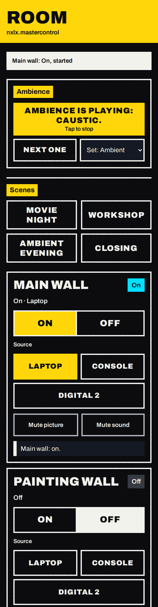
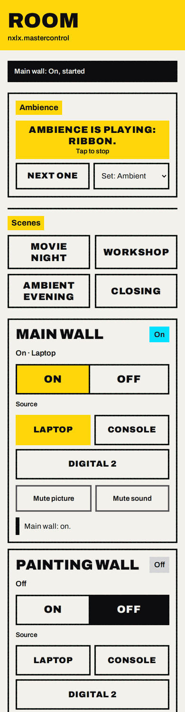
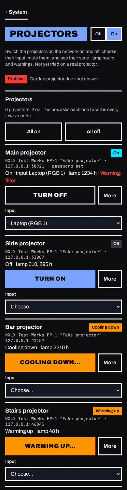
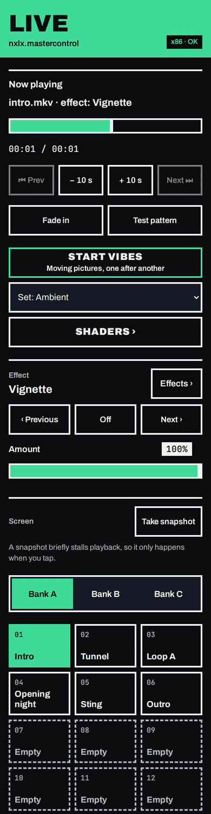
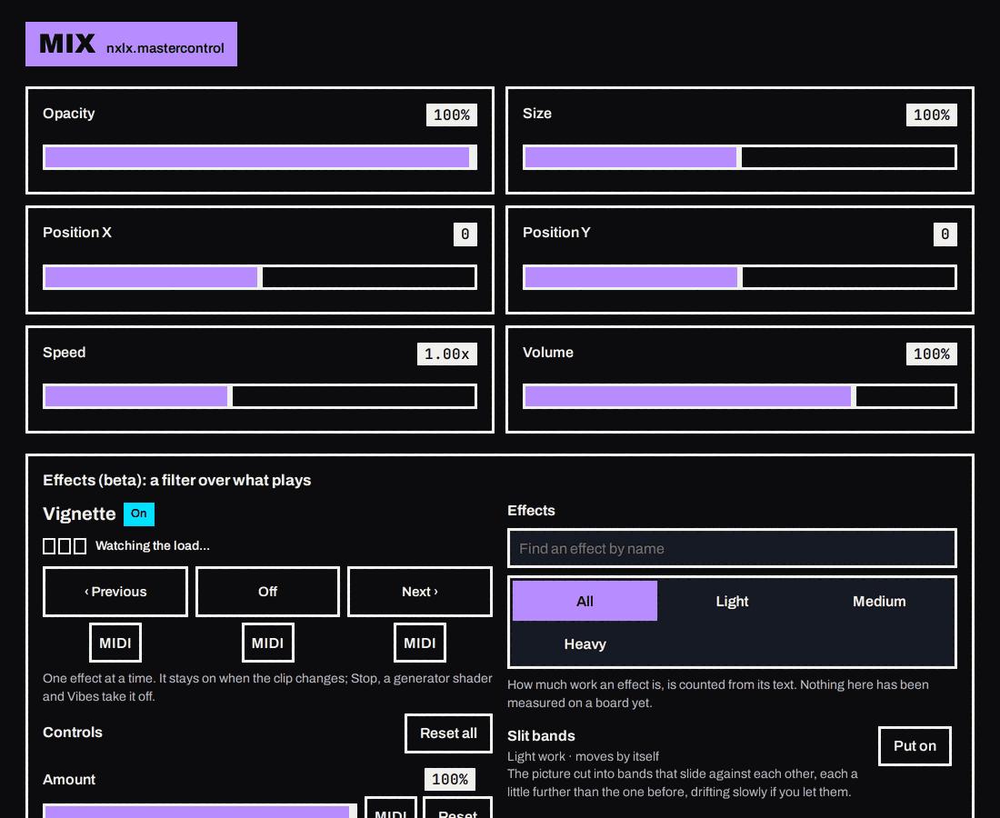

<!-- SPDX-FileCopyrightText: 2026 NXLX.Systems and contributors
     SPDX-License-Identifier: Apache-2.0 -->
# The panel

The pictures on this page are made by `tests/ui/screenshots.js`, which drives the real panel against the same test harness as the browser test: a headless player, two-second test clips and a **fake network helper**. So the clip names, the addresses (`192.168.1.9`, `192.168.0.40`, the projectors at `192.168.1.50` and `.51`), the join codes and the network ports shown are made up for the picture; nothing here was taken from a real board. The Box and Sound output cards show the machine that took the pictures (a CI runner), not a Pi. Regenerate them with:

```
SHOTS=docs/images/ui node tests/ui/screenshots.js     # needs playwright, Chromium and mpv, like tests/ui/panel.test.js
```

The CI job "panel-ui" also runs it and uploads the result as the `ui-screenshots` artifact, so a change that breaks a screen shows up there.

## The Workspace shell (2026-10-08, D65)

The panel is laid out as four areas, each with screens that have one job. **The pictures further down this page were taken before that** and show the five tabs it had (Room, Live, Mix, Media, System); the cards in them are the same cards, in new places. New pictures come from the `ui-screenshots` artifact of a CI run of the browser job (`signal-<screen>-phone` and `-laptop` for every screen in `tests/ui/signal-pages.js`); none has been copied into `docs/images/ui` yet.

| Area | Screens | What is on them (every card is the one the panel had) |
| --- | --- | --- |
| **Play** | Pads | the big Vibes button with its set chooser, the banks, the pads, Edit pads, Transition between clips and its duration, the Screen card (Take snapshot) |
| | Library | everything the Media tab had: Refresh, Quick play, Live input, Slideshow, Upload clips, the clips (Play, Info, Rename, Delete), USB drives |
| | Shaders | the Shaders and Vibes page (while its module is on) |
| **Shape** | Effect | the Effects card (while Shaders and Vibes is on) |
| | Picture | Opacity, Size, Position X and Y, Mirror, Overlay picture, Rotate, Reset mix |
| | Sound | Volume, Audio on or mute, and the Sound page's output card |
| | Mapping | the Projection mapping page with its switch (a presenter: the card alone) and Test pattern, while its module is on (with it off, Test pattern is on Picture) |
| **Room** | Scenes | ambience, the scenes |
| | Walls | each group, and Everything (All on, All off) |
| | Guests | Let someone in (a presenter and the owner) |
| **Setup** | the index, then a page per row | everything System had; the page Room holds the room's set-up (groups and scenes) |

**Getting about (D72).** Under 600 px wide the areas are tabs at the foot and the open area's screens are a row under the title. From 600 px a rail at the left (96 px) has one button per area and nothing else, and the open area's screens are tabs across the top of the workspace. From 1200 px an area is a desk: Pads, Library and Shaders stand side by side on one page, as do Effect, Picture and Sound (Effect the widest; Mapping needs the whole width and is a tab beside the desk) and Scenes, Walls and Guests; each column has its name, and none is marked as the open one. A desk has the columns the device's role has and whose module is on; with one column left it is just that screen. In Setup the index stays at the left (272 px) while a page is open beside it, so one press leads from page to page; under 1200 px a row opens its page and Back leads to the index, and the phone's back gesture does the same at every width. The title bar names the area and says the open screen's job (the area's, where its screens share the page). The rows Shaders and Vibes, Projection mapping and Sound of the Setup index open the screens of Play and Shape where those things are used. A screen whose module is switched off is not there; its row of the owner's Setup index opens a page with its switch.

An area is one build with a column per screen at every width, and the stylesheet shows one column or all of them: a tab of the same area or a change of the window's width draws nothing again, so what is being typed stays, and no card is on the page twice.

**The transport strip** is at the foot of every screen at every width: what is playing, the time, the place in the clip, Speed, Loop, Previous, back and forward 10 seconds, Next, Fade in, Fade out, Freeze, Stop, Blackout. These are the controls Live had in its Now playing card and its bottom row, and Mix's Speed and Loop; they are nowhere else now. It is one line from 600 px, with Freeze, Stop and Blackout at its right end and at least 180 px for the name of what plays; the clip count and the time under the name are never broken. What else is on the line follows one order of who has the room first: Previous and Next from 800 px, Loop from 940, Speed from 1080, Fade in and Fade out from 1280, back and forward 10 seconds from 1440, the place in the clip from 1640; what is not on the line is behind **More**. Under 600 px it shows what is playing, Previous, Next, Stop and Blackout, and **More** opens the rest under them, in place, until **Less** is tapped.

**Sizes.** The size classes of the resizing study are asked of the panel itself through container queries: compact under 600 px, medium 600 to 899, expanded 900 to 1199, large 1200 to 1599, extra large from 1600; a window under 480 px high is short. The cards ask the column they are in how much room they have (every column of a desk, and the one screen of a narrower panel, is the container `ws`), so a page's two columns come when the page itself has 900 px, and the three of the Shaders page when it has 1100: in Setup beside the index from about 1270 px of panel, and for the Shaders column of Play from 1700 and 1900 px. A card in a 380 px column of a desk has the form it has on a phone. Control heights are the tokens, 44 and 56 px, at every size.

**Who sees what.** Everyone has the four areas. A presenter has the pages of Setup a presenter can use (Health, Projectors, People and codes, Streams, Boxes in step, About and power) and the mapping card without its switch; a guest has no Guests screen and only Health and About and power in Setup, and every control a guest cannot use is greyed as before. Both start on Room > Scenes.

Measured in headless Chromium (CI) and headless Edge (the dev Mac). Nobody has seen it on a phone, in Safari or on the box.

## Pairing

Enter the four digit PIN shown on the box (`sudo pvj-pin`, or the projector test screen). A device is remembered until it is removed.


## Live

Twelve pads per bank, three banks. The pad that is playing is lit. Fade out, Freeze and Blackout are always at the bottom. While the Shaders and Vibes module is on, a large Vibes button sits under Now playing ("Start Vibes", then "Vibes is playing: Aurora"), with a Shaders link next to it that opens the Shaders page.


The wide layout on a laptop or tablet, and one of the four colour themes of the default look (Dark stage is the default; Night red keeps a dark room dark). A second style, Signal, is at the end of this page:


### Transport and snapshot

Under Now playing: the position slider, Prev and Next (greyed out here because one clip is playing, not a list), 10 seconds back and forward, Fade in and Test pattern. Below it, Take snapshot shows one picture of what the box is showing, only when tapped.


## Mix


### Mirror and overlay

Flip left-right and upside down for rear projection or a mirror rig. The overlay puts a PNG from the media folder over the video (a logo, or a mask).


### Projection mapping (beta)

Shown when the Projection mapper module is on. The canvas is the screen, drawn small: here a 3x2 grid named Back wall and a quad named Side panel, the chosen surface in yellow with its chosen corner in pink. Below: nudge buttons, the surface list in layer order, and saved mappings. See [MAPPER.md](../pvj/MAPPER.md).


## Media

Upload from the phone, play, rename or delete. Only full-access devices can change files.


### Quick play and slideshow

Quick play plays the whole folder (looping, once or shuffled) or the clips whose names start with a number. The slideshow shows the pictures of the media folder or a USB drive, one after another.


The Live input card (USB capture stick or webcam) appears only when the box has such a device; the machine that takes these pictures has none, so it has no picture here.

## System

System is a short list in three groups (Everyday, Show tools, This box), with Health above them and one page per row. Each row has a word for how it is doing (Off, Set up, Ready, Active, Problem) and a sentence. A module's page has its switch at the top right; while the module is off the page shows what it does and one button to switch it on. That switch is the only one for a feature: DMX, MIDI, the schedule, OSC and Remote support have no second button inside. A control with one safe effect is applied on tap; Save changes is only where several fields change together, cannot be pressed until something changed, and says "Not saved yet" while it has. The cards below are each on their own page.

Every page uses the same few patterns (D50): a visible label above each field with an optional hint below (placeholders are examples only); small capitals only for labels of three words or fewer, sentences in normal case; one list row (name, one state line, a red problem line when there is one, at most one main button, **More** for the rest, Remove last); one Add form ("+ Add a ...", open in place, the button says Add, a refusal is said under it); a question in place before every Remove and before anything that changes what the room sees or locks someone out (no browser dialog anywhere); a result said beside the button that caused it as well as in the page's message line; empty states that say what the thing is for and the first step. From about 900 px the pages with a lot on them (Projectors, Schedule, Network, People and codes, MIDI controller, DMX) use two columns, with a list that scrolls by itself and its form beside it. CI makes whole-page pictures of them in the `ui-screenshots` artifact (`page-projectors`, `page-schedule`, `page-dmx`, `page-network`, `page-about`, `page-support`, `page-streams`, `page-autostart`, and `page-projectors-laptop`, `page-schedule-laptop`, `page-network-laptop`, `page-people-laptop`). **The pictures further down this page were made before this pass and show the older cards.**

Shaders and Vibes has one page for everything, and it is an instrument: what is on screen with its load and picture detail, the playing shader's controls by type (sliders, switches, choices, colours, an XY pad, buttons) under Speed, Colour turn and Brightness trim, its presets, the library with its filters, the Vibes settings and sets, and the controllers. A phone stacks them in that order. On a laptop the library is a column on the left that scrolls by itself, the stage (now, controls, presets) is in the middle and the sets and controllers on the right. A small MIDI button beside a control opens its teach box in place. Live keeps the big Vibes button and gets Previous, Next and a strip of the playing shader's Speed and first four controls (a column on the right on a laptop). CI makes pictures of them (`shaders-page`, `shaders-page-laptop`, `shaders-instrument`, `live-vibes`, `live-shader-laptop` in the `ui-screenshots` artifact); they are not in `docs/images/ui` yet.

### Box and sound output

This box: versions, storage, the screen outputs (their modes under Advanced), the box clock; then Restart and power (Restart player, Restart the box, Power off, each asking first). Sound output chooses where the sound goes (applied on tap) and plays a test sound on the left, right or both speakers.


### Autostart


### Beta modules

| Weekly schedule (see [SCHEDULE.md](../pvj/SCHEDULE.md)) | Streams (see [STREAMS.md](../pvj/STREAMS.md)) |
| --- | --- |
|  |  |

The schedule above has an entry of each kind: projectors on, play a clip, a legacy start script, blackout and projectors off.

Projectors (see [PROJECTORS.md](../pvj/PROJECTORS.md)): one row per projector with one power button that follows its state (Turn on, Warming up..., Turn off, Cooling down...), the input list, and More (blank the picture, mute the sound, name the inputs, check, edit, remove); All on and All off for two or more. The one with a password says so; the password itself is never shown.


| DMX (see [DMX.md](../pvj/DMX.md)) | MIDI (see [MIDI.md](../pvj/MIDI.md)) |
| --- | --- |
|  |  |

Network settings (wired and Wi-Fi) always revert by themselves unless you confirm them. See [NETWORK.md](../pvj/NETWORK.md).


### Control, appearance and access

| OSC (see [OSC.md](../pvj/OSC.md)) | Appearance | Access |
| --- | --- | --- |
|  |  |  |

The "Let someone in" card of People and codes shows a guest code and a presenter code, each with its QR code, how long it still works and how many uses are left. The picture above may be older than this: the roles are now named Guest (can watch), Presenter (can play and mix) and Owner (everything), and a presenter gets this card with the guest code only.

## The Signal look

A second style for the whole panel, chosen under System > Look (**Signal** for a dark room, **Signal light** for a bright one). It is not the default; the pictures above are the default look. Signal is the direction "D. Signal" from the redesign's Figma file: a gig poster. Very large capitals in Archivo Black, numbers in JetBrains Mono, square corners, 3 px rules, flat blocks of colour, and one colour per part of the panel.

| Part of the panel | Colour | What takes it |
| --- | --- | --- |
| Room | yellow `#ffd60a` | the title block, the open tab, primary and chosen buttons, the On half of a switch, a slider's fill, the focus ring |
| Shaders and Vibes (the page) | pink `#ff4fa3` | the same |
| Live and Media | green `#3ddc97` | the same |
| Mix | violet `#b78cff` | the same |
| System and its other pages | blue `#7aa2ff` | the same |

States keep their own colours wherever they appear, and always carry the word: Off grey, Set up orange `#ff9500`, Ready the text colour, Active cyan `#00e0ff`, Problem red `#ff3b30`. No state is ever drawn in an area's colour. An error line is red, and so is whatever destroys something or stops the room (All off, Power off, a factory reset, the "yes" of a question asked in place). In Signal light the area colour is only ever a filled block with black words on it; rings and thin lines are black, because yellow on an off-white page cannot be seen.

What changes shape: a card on a phone loses its box (a label, then what belongs to it) and is a ruled panel on a laptop; the switch is two halves that say OFF and ON; a state chip is a solid block; a slider is a ruled bar filled up to its value; the tab bar is five words under a rule, the open one a block of colour. Archivo Black in capitals is for screen titles, a group's name and the largest actions; smaller buttons, tabs, chips, headings and labels are in the lighter weights in sentence case (the owner's word after the first pass), and a sentence, a clip's name and a file's name are never in capitals. Numbers are in JetBrains Mono. A small set of choices is a segmented control in one frame; a slider's value is a block beside its name; what an action did is a toast above the tab bar that goes by itself; on a phone every section starts under a rule.

| Room on a phone | Room in Signal light | Projectors: every power state |
| --- | --- | --- |
|  |  |  |

**Room** is made to be read at arm's length in the dark. Ambience is a block of its own under a yellow label (it starts shaders, but the colour belongs to the screen, so it is Room yellow here). Scenes are large blocks. Each group is a ruled panel: its name large, its state as a chip, On and Off as the two halves of one tall switch with the half in force filled, the sources as large buttons with the chosen one filled, the two mutes quieter, and what the last press did in a ruled line. "Everything" stands apart under a double rule, with All off in red and its question in place. On a laptop or a wall tablet ambience sits beside the scenes and the groups are in columns.

**Projectors** says each projector's power in a chip beside its name (On, Off, Warming up, Cooling down, No answer), and the one power button looks different in each state: Turn on is the block of colour, Turn off an outline (it asks first), Warming up and Cooling down an orange block that cannot be pressed, Try again an outline in red.

| Live with the effects strip | Mix on a laptop, with the Effects card |
| --- | --- |
|  |  |

Everything that can be tapped is at least 44 px, and 56 px where staff press on Room and Live; no text is under 13 px. The browser test checks these on every screen, page and state, at 390 and 1366 px in the dark and at 390 px in the light, together with the contrast of every text against what is behind it, that no word in capitals is cut, that no sentence is in capitals and that no state wears an area's colour.

The pictures are taken by `tests/ui/screenshots.js` from the list in `tests/ui/signal-pages.js` (every screen, every System page, and states such as a question asked in place, a network change waiting to be confirmed, a page whose module is off, the pairing screen), named `signal-<page>-phone` and `-laptop`, with `-phone-light` for some; they are in the `ui-screenshots` artifact of each CI run, and the five above are copies of them at half size. Each main screen is titled with its area's name in capitals (LIVE, not the panel's name, which is the small line under it). The values, the rules and the decisions that Figma does not hold are in [pvj/THEMES.md](../pvj/THEMES.md).

The Appearance picture further up is older than this: the card now has two more buttons, Signal and Signal light.
